### 1. 아웃풋

sample gcc output

15~17

내 아웃풋 

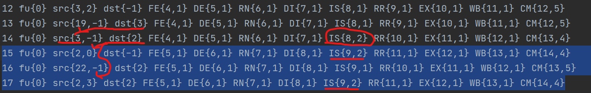

정답 아웃풋 

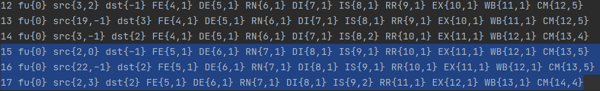

18~20

내 아웃풋

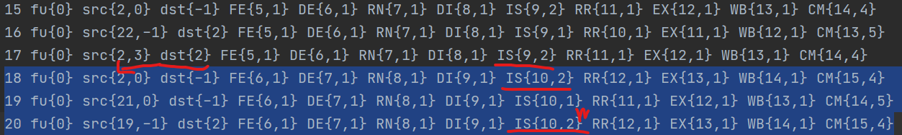

정답 아웃풋

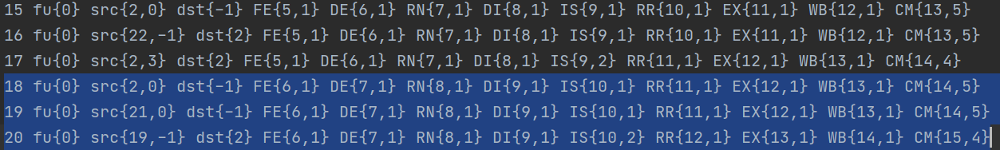

sample perl output

내 아웃풋

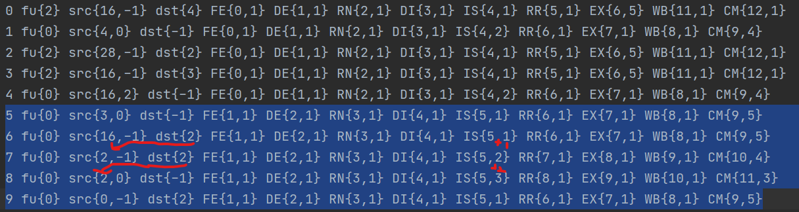

정답 아웃풋

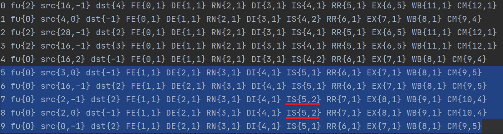

잘못된 부분은 아마 구현 방법에 문제가 있다.  과제 설명서에 보면 아래와 같이 써져있다. 이렇게 구현하게 될 경우 위에서 설명한 문제가 생긴다. 왜냐하면 하나의 인스트럭션을 issue하고 ready table에서 ready로 바꾸기 때문이다.

> Each time finding the next oldest ready instruction and then issuing it. 

### 2. Rename Stage

- 만약 Rename Stage에서 새로운 Register를 3개 얻어야하는데(width=3) 2개만 얻을 수 있을 경우 어떻게 처리해야 할까? 이 경우를 어떻게 처리하는지에 따라서 성능이 달라졌다...

  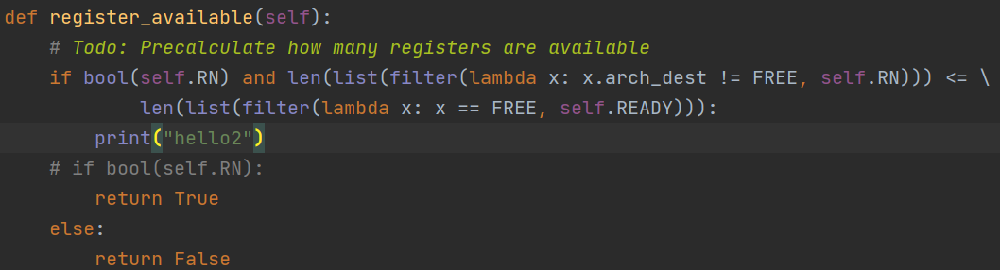

  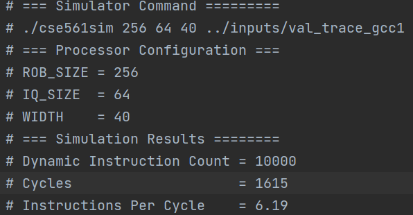

  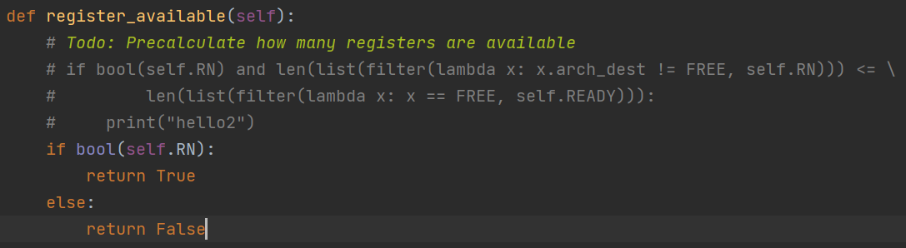

  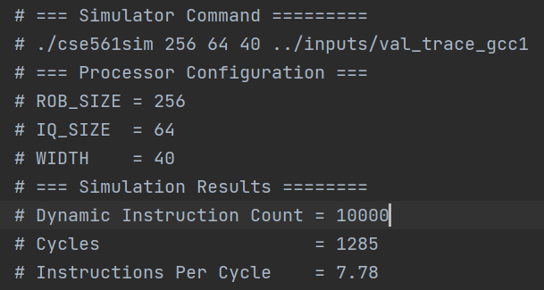

- Reorder Buffer의 크기 체크는 여기서 Rename Stage에서 하는 건가? --> Fetch Stage에서 한다.

- RR bundle을 왜 체크하는건가?

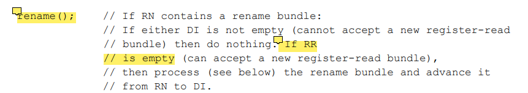

### 3. Issue Stage

- 무조건 Issue할 때마다 ReadyTable에서 output register를 ready로 만들어야 하는건가? (수업 시간에 Load의 경우 Ready로 만드는 시점이 다르다고 배웠다.)

- Fetch Step에서는 아래 설명이 빠졌다.

  > Increment sequence number to each instruction as it is fetched from the trace files.

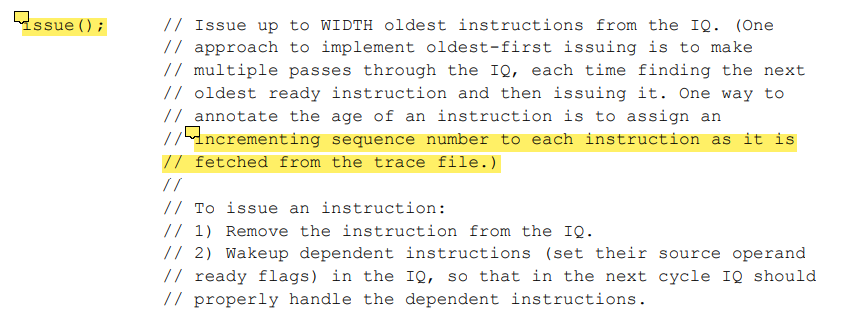

### 4. Val 결과

Sample은 맞췄지만 프로그램이 제대로 작동하는지 확인하기 위해서는 더 많은 테스트 케이스가 필요하다. 혹시 다른 테스트 케이스는 없을까?

### 5. Fetch Stage

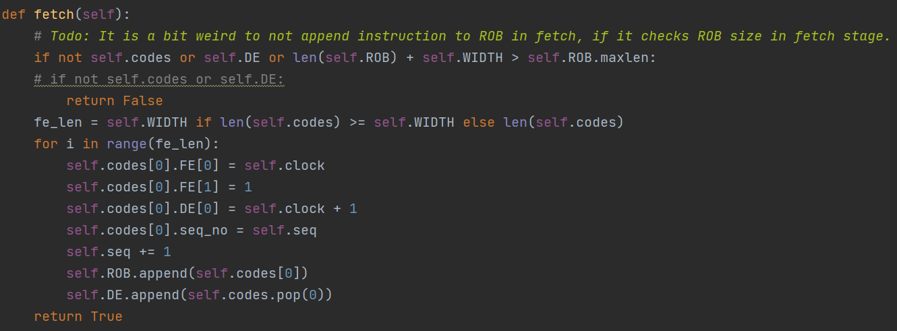

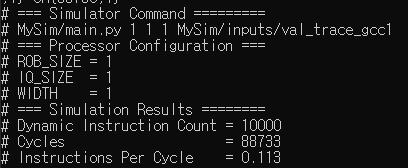

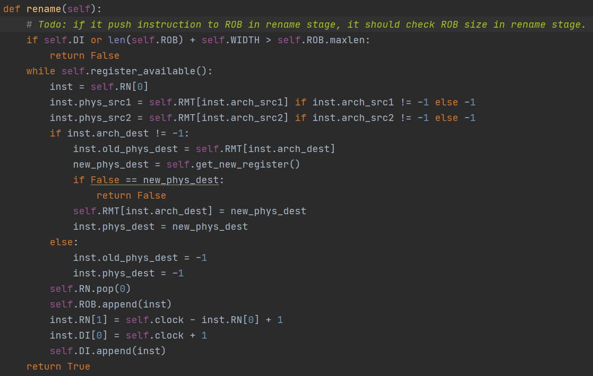

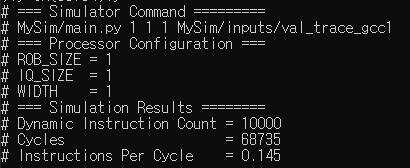

